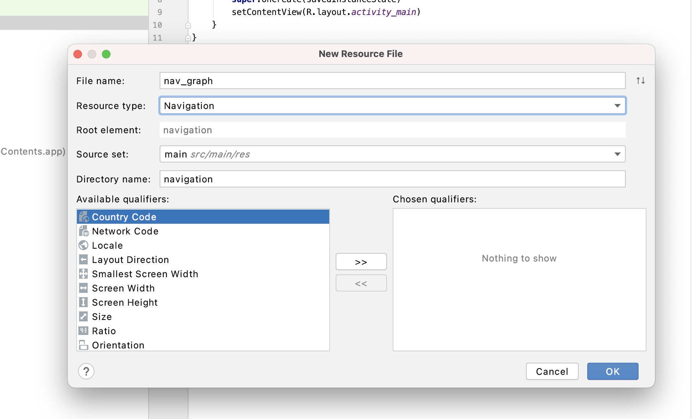
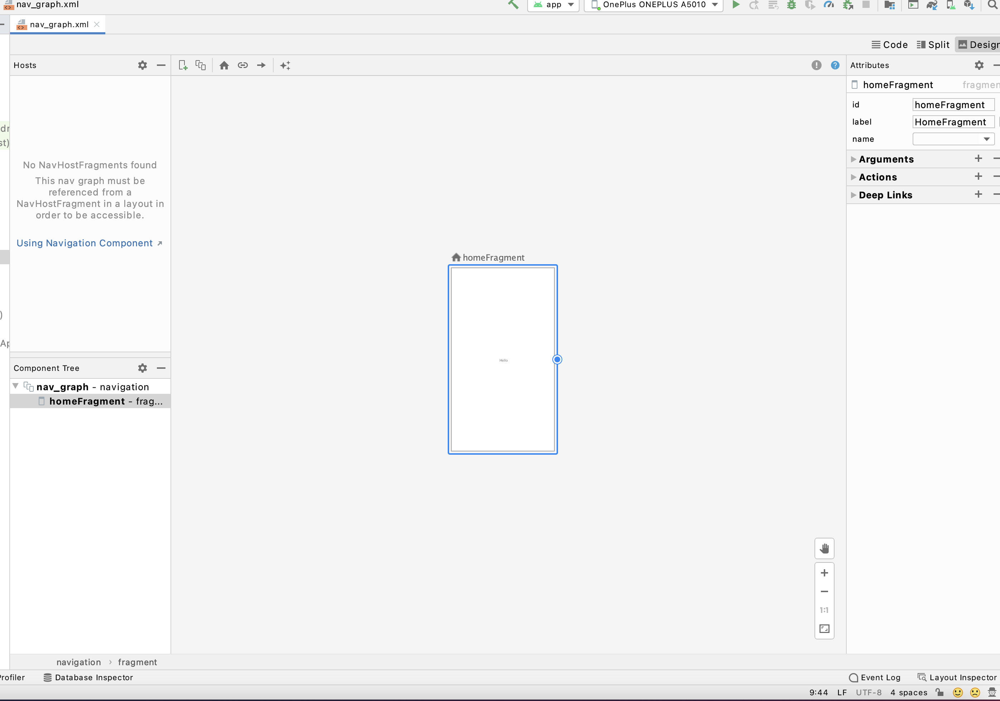

Setup Toolbar with navController - Android Navigation Component


## Step.1 

Include navigation fragment and navigation ui dependency to app level build.gradle and sync project. 

```groovy
dependencies {
  def nav_version = "2.3.3"

  // Java language implementation
  implementation "androidx.navigation:navigation-fragment:$nav_version"
  implementation "androidx.navigation:navigation-ui:$nav_version"

  // Kotlin
  implementation "androidx.navigation:navigation-fragment-ktx:$nav_version"
  implementation "androidx.navigation:navigation-ui-ktx:$nav_version"

}
```

## Step 2. 

Right click on res folder and click New ->  Android Resource File 
Name the file (like nav_graph.xml) and select Navigation as resource type from drop down. 
This will create a navigation folder under the res directory. In this navigation folder our nav_graph.xml will be created. If you have not done step 1 then while creating nav_graph.xml file Android Studio will show a popup to automatically add those navigation component dependencies for you. Just allow it to do so in that case.



## Step 3.

Add NavHost Fragment in you activity xml.



```js
<?xml version="1.0" encoding="utf-8"?>
<androidx.constraintlayout.widget.ConstraintLayout
    xmlns:android="http://schemas.android.com/apk/res/android"
    xmlns:app="http://schemas.android.com/apk/res-auto"
    xmlns:tools="http://schemas.android.com/tools"
    android:layout_width="match_parent"
    android:layout_height="match_parent"
    tools:context=".MainActivity">

 
    <androidx.fragment.app.FragmentContainerView
        android:id="@+id/nav_host_fragment"
        android:name="androidx.navigation.fragment.NavHostFragment"
        android:layout_width="0dp"
        android:layout_height="0dp"
        app:layout_constraintLeft_toLeftOf="parent"
        app:layout_constraintRight_toRightOf="parent"
        app:layout_constraintTop_toTopOf="parent"
        app:layout_constraintBottom_toBottomOf="parent"

        app:defaultNavHost="true"
        app:navGraph="@navigation/nav_graph" />

</androidx.constraintlayout.widget.ConstraintLayout>
```


#### Below 4 main xml attributes to notice.

- `id`: id of our host fragment

- `name`: this must be exact androidx.navigation.fragment.NavHostFragment so that this fragment can be labelled as navHostFragment.

- `defaultNavHost`: Set it true. In case of 2 pane layouts we can have more than one navHost. We need to tell the navigation library which one is our default navHost fragment so that it can render the correct destination when the app launches for the first time.

- `navGraph`: this is our nav_graph that we created in step 2.


## Step 4: 


Add one fragment and its xml.

HomeFragment.kt
```java
class HomeFragment : Fragment() {

   private var _binding: FragmentHomeBinding? = null
   private val binding get() = _binding!!

   override fun onCreateView(
       inflater: LayoutInflater,
       container: ViewGroup?,
       savedInstanceState: Bundle?
   ): View {

       _binding = FragmentHomeBinding.inflate(inflater, container, false)
       val view = binding.root
       return view
   }

   override fun onDestroyView() {
       super.onDestroyView()
       _binding = null
   }
}
```
Fragment_home.xml
```js
<?xml version="1.0" encoding="utf-8"?>
<androidx.constraintlayout.widget.ConstraintLayout xmlns:android="http://schemas.android.com/apk/res/android"
   xmlns:app="http://schemas.android.com/apk/res-auto"
   xmlns:tools="http://schemas.android.com/tools"
   android:layout_width="match_parent"
   android:layout_height="match_parent"
   tools:context=".MainActivity">

   <androidx.fragment.app.FragmentContainerView
       android:id="@+id/nav_host_fragment"
       android:name="androidx.navigation.fragment.NavHostFragment"
       android:layout_width="0dp"
       android:layout_height="0dp"
       app:defaultNavHost="true"
       app:layout_constraintBottom_toBottomOf="parent"
       app:layout_constraintLeft_toLeftOf="parent"
       app:layout_constraintRight_toRightOf="parent"
       app:layout_constraintTop_toTopOf="parent"
       app:navGraph="@navigation/nav_graph" />


</androidx.constraintlayout.widget.ConstraintLayout>
```

Now open nav_graph.xml , design view. 
Now we are going to add homeFragment to our graph. And make it start destination so that when the app launches it renders homeFragment as default screen. 

Click on + and select Homefragment. This will add it to our graph. In the design view you can see a preview of HomeFragment. If preview is not shown and if it is showing ? instead of UI. Then open the code view of nav_grap.xml and add layout to your fragment like below code.
```js
<?xml version="1.0" encoding="utf-8"?>
<navigation xmlns:android="http://schemas.android.com/apk/res/android"
   xmlns:app="http://schemas.android.com/apk/res-auto"
   xmlns:tools="http://schemas.android.com/tools"
   android:id="@+id/nav_graph"
   app:startDestination="@id/homeFragment">

   <fragment
       tools:layout="@layout/fragment_home"
       android:id="@+id/homeFragment"
       android:name="com.sunelsoftwares.blogappcontents.HomeFragment"
       android:label="HomeFragment" />
</navigation>
```

Now if you run the app you can see that HomeFragment is opened by default since it is our start destination. You can see in above nav_graph.xml under the navigation tag one startDesitnation attribute is added automatically while adding homeFragment to our graph. startDestination is a mandatory attribute. In the design view you also see that one home icon is added just above homeFragment which indicates that this is our startDestination of graph. If you have more than one fragment in the graph which is an idle case. Then in that case if you want to change the start destination then you can click on any fragment in the design view and then click one home icon in the top bar near +add destination button. 


 
Now your app is ready to use navigation ui. We have set up our navigation graph with the start destination.


## Step 5.

Go to themes.xml under res->values and use NoActionBar theme as parent because we are going to use our own toolbar instead of default one.
```js
<style name="Theme.BlogAppContents" parent="Theme.MaterialComponents.DayNight.NoActionBar">
   <!-- Primary brand color. -->
   <item name="colorPrimary">@color/purple_500</item>
   <item name="colorPrimaryVariant">@color/purple_700</item>
   <item name="colorOnPrimary">@color/white</item>
   <!-- Secondary brand color. -->
   <item name="colorSecondary">@color/teal_200</item>
   <item name="colorSecondaryVariant">@color/teal_700</item>
   <item name="colorOnSecondary">@color/black</item>
   <!-- Status bar color. -->
   <item name="android:statusBarColor" tools:targetApi="l">?attr/colorPrimaryVariant</item>
   <!-- Customize your theme here. -->
</style>
 ```

Now go to acitivity_main.xml and add a toolbar to it. 
```js
<?xml version="1.0" encoding="utf-8"?>
<androidx.constraintlayout.widget.ConstraintLayout xmlns:android="http://schemas.android.com/apk/res/android"
   xmlns:app="http://schemas.android.com/apk/res-auto"
   xmlns:tools="http://schemas.android.com/tools"
   android:layout_width="match_parent"
   android:layout_height="match_parent"
   tools:context=".MainActivity">
  
<androidx.appcompat.widget.Toolbar
   android:id="@+id/toolbar"
   app:layout_constraintBottom_toTopOf="@+id/nav_host_fragment"
   app:layout_constraintLeft_toLeftOf="parent"
   app:layout_constraintRight_toRightOf="parent"
   app:layout_constraintTop_toTopOf="parent"
   android:layout_width="match_parent"
   android:layout_height="wrap_content"/>
  
   <androidx.fragment.app.FragmentContainerView
       android:id="@+id/nav_host_fragment"
       android:name="androidx.navigation.fragment.NavHostFragment"
       android:layout_width="0dp"
       android:layout_height="0dp"
       app:defaultNavHost="true"
       app:layout_constraintBottom_toBottomOf="parent"
       app:layout_constraintLeft_toLeftOf="parent"
       app:layout_constraintRight_toRightOf="parent"
       app:layout_constraintTop_toBottomOf="@+id/toolbar"
       app:navGraph="@navigation/nav_graph" />


</androidx.constraintlayout.widget.ConstraintLayout>
```

Setup toolbar as action bar in MainActivity.kt
```java
class MainActivity : AppCompatActivity() {
   private lateinit var binding: ActivityMainBinding

   override fun onCreate(savedInstanceState: Bundle?) {
       super.onCreate(savedInstanceState)
       binding = ActivityMainBinding.inflate(layoutInflater)
       val view = binding.root
       setContentView(view)

       //setup aciton bar
       setSupportActionBar(binding.toolbar)
      
   }
}
```

Then find navHost Fragment from supportFragmentManager using its id. Then findNavController and setup action bar with navController.
```java
class MainActivity : AppCompatActivity() {
   private lateinit var binding: ActivityMainBinding

   override fun onCreate(savedInstanceState: Bundle?) {
       super.onCreate(savedInstanceState)
       binding = ActivityMainBinding.inflate(layoutInflater)
       val view = binding.root
       setContentView(view)

       //setup aciton bar
       setSupportActionBar(binding.toolbar)

       val navHost =
           supportFragmentManager.findFragmentById(R.id.nav_host_fragment) as NavHostFragment
       val navController = navHost.findNavController()

       NavigationUI.setupActionBarWithNavController(this, navController)
   }
   ```
   
Now if you run the app you will see the title of the toolbar as HomeFragment. This title is the same as “label” we have given to HomeFragment in nav_graph.xml . IF you change the toolbar title will change also. 


If you have more than one destination in a graph and if you navigate to another destination then the up icon or back arrow is automatically added to your toolbar. 


So that’s all about setting up the toolbar with NavController. I will cover app bar configuration while we have more than one top level destination like in  case of bottom navigation view in next blog.
